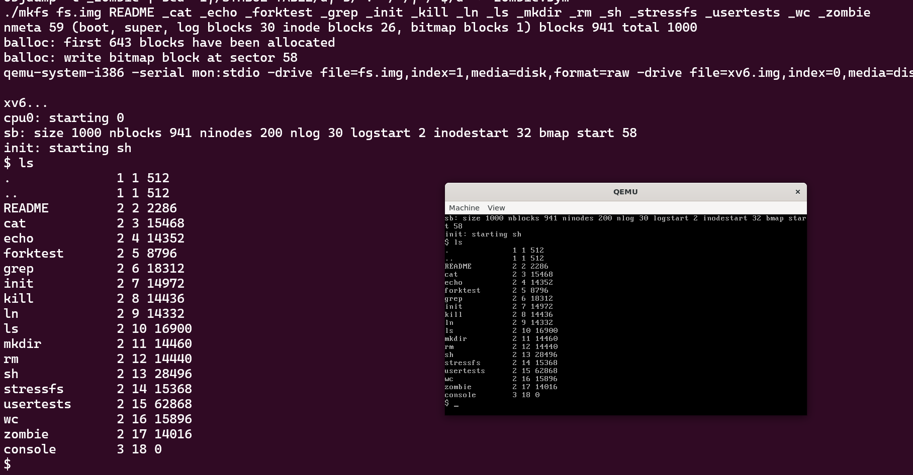

# os
南大操作系统学习

[守住发际线：南大蒋炎岩谈读博那些事儿](https://www.jiqizhixin.com/articles/2019-09-16-17)

xv6-public： （x86）
https://github.com/mit-pdos/xv6-public/tree/master
~~~

make 
make qemu

ctrl a , x 退出
~~~

- 调试 （参考jyy,50 min ,  https://www.bilibili.com/video/BV1N741177F5/?p=8&vd_source=abeb4ad4122e4eff23d97059cf088ab4）

xv6的编译选项可改为 O1, 源代码更好对应

~~~
$ make qemu-gdb

*** Now run 'gdb'.
qemu-system-i386 -serial mon:stdio -drive file=fs.img,index=1,media=disk,format=raw -drive file=xv6.img,index=0,media=disk,format=raw -smp 2 -m 512  -S -gdb tcp::26000
QEMU 6.2.0 monitor - type 'help' for more information
(qemu) info registers
EAX=00000000 EBX=00000000 ECX=00000000 EDX=00000663
ESI=00000000 EDI=00000000 EBP=00000000 ESP=00000000
EIP=0000fff0 EFL=00000002 [-------] CPL=0 II=0 A20=1 SMM=0 HLT=0
ES =0000 00000000 0000ffff 00009300
CS =f000 ffff0000 0000ffff 00009b00
SS =0000 00000000 0000ffff 00009300
DS =0000 00000000 0000ffff 00009300
FS =0000 00000000 0000ffff 00009300
GS =0000 00000000 0000ffff 00009300
LDT=0000 00000000 0000ffff 00008200
TR =0000 00000000 0000ffff 00008b00
GDT=     00000000 0000ffff
IDT=     00000000 0000ffff
CR0=60000010 CR2=00000000 CR3=00000000 CR4=00000000
DR0=00000000 DR1=00000000 DR2=00000000 DR3=00000000
DR6=ffff0ff0 DR7=00000400
EFER=0000000000000000
FCW=037f FSW=0000 [ST=0] FTW=00 MXCSR=00001f80
FPR0=0000000000000000 0000 FPR1=0000000000000000 0000
FPR2=0000000000000000 0000 FPR3=0000000000000000 0000
FPR4=0000000000000000 0000 FPR5=0000000000000000 0000
FPR6=0000000000000000 0000 FPR7=0000000000000000 0000
XMM00=0000000000000000 0000000000000000 XMM01=0000000000000000 0000000000000000
XMM02=0000000000000000 0000000000000000 XMM03=0000000000000000 0000000000000000
XMM04=0000000000000000 0000000000000000 XMM05=0000000000000000 0000000000000000
XMM06=0000000000000000 0000000000000000 XMM07=0000000000000000 0000000000000000
(qemu)

另一个窗口执行： 
$ bash debug-xv6.sh

~~~

~~~

在wsl中进入xv6源码目录

使用make qemu 命令在qemu中启动xv6系统，此时是xv6系统的命令行模式

1.如果需要切换到qemu的monitor中 ，需要 按下Ctrl+a ,然后释放按键，再按c ,即可进入qemu的monitor 命令行模式，在该模式下可以使用 info mem, info registers 等命令查看虚拟机此时的状态，如果需要返回xv6系统的命令行，同样需要先按下Ctrl+a，然后释放按键，之后再按c即可

2.在xv6系统命令行模式下 ，按下Ctrl+a, 释放按键后再按x，即可关闭qemu虚拟机

3.在qemu monitor模式下，输入quit，即可关闭qemu虚拟机
~~~